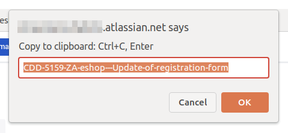

# Jira bookmarklets to quickly copy ticket info
Drag those links to the bookmarks section of your browser to bookmark them. after that you can simply click on the saved bookmark any time you are on a (Atlassian) Jira ticket page and it will popup a dialog from which you can easily copy Jira data to be used while working on your projects.

* <a href='javascript:(function(){var js=document.body.appendChild(document.createElement("script"));js.onerror=function(){alert("Sorry, the script could not be loaded.")};js.src="https://cdn.jsdelivr.net/gh/dirkdesmet/bookmarklets@master/copy-jira-ticket-title.js"})();'>Copy JIRA ticket title</a>
* <a href='javascript:(function(){var js=document.body.appendChild(document.createElement("script"));js.onerror=function(){alert("Sorry, the script could not be loaded.")};js.src="https://cdn.jsdelivr.net/gh/dirkdesmet/bookmarklets@master/copy-jira-ticket-title-git-branch-friendly.js"})();'>Copy JIRA ticket title (GIT branch friendly)</a>

(edit: Sorry, Github filters out a href's in my example - just copy those links below into a bookmark and you're ready)

Copy JIRA ticket title:
```javascript
javascript:(function(){var js=document.body.appendChild(document.createElement("script"));js.onerror=function(){alert("Sorry, the script could not be loaded.")};js.src="https://cdn.jsdelivr.net/gh/dirkdesmet/bookmarklets@master/copy-jira-ticket-title.js"})();
```
Copy JIRA ticket title (GIT branch friendly):
```javascript
javascript:(function(){var js=document.body.appendChild(document.createElement("script"));js.onerror=function(){alert("Sorry, the script could not be loaded.")};js.src="https://cdn.jsdelivr.net/gh/dirkdesmet/bookmarklets@master/copy-jira-ticket-title-git-branch-friendly.js"})();
```


